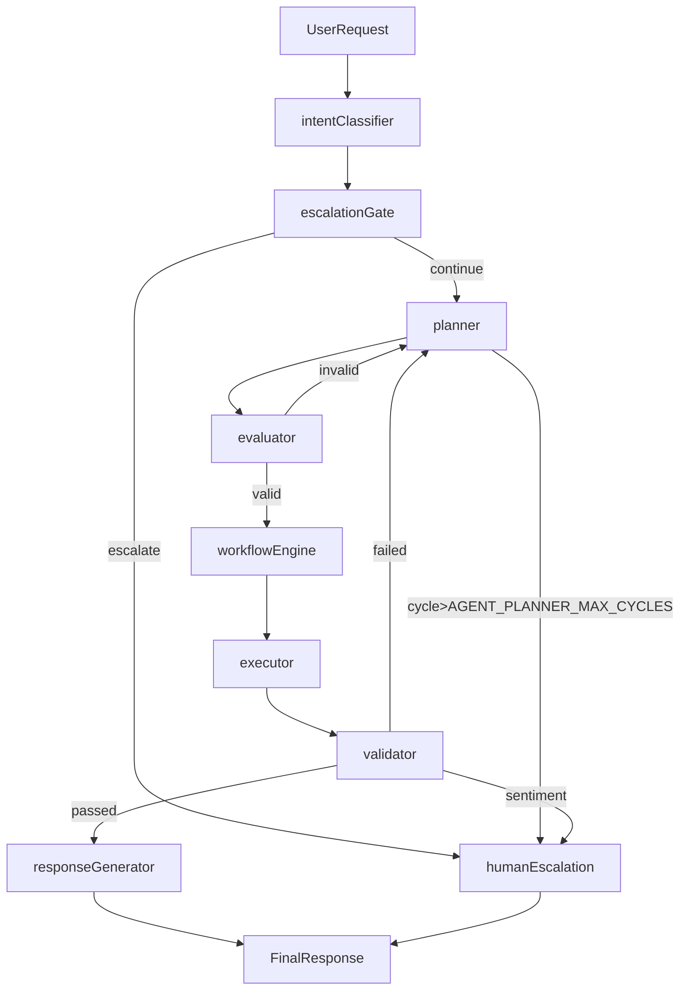

## Agent Architecture (Runtime)

This spec defines the **runtime agent architecture** for iBud, including stage boundaries, model routing, workflow state, escalation policy, and interfaces between components.

### High-level flow

The runtime flow is:

`intent_classifier -> planner -> evaluator -> workflow_engine -> executor -> validator -> response_generator`

Key properties:
- **Planner uses a larger model** (default: `glm-5` on Ollama).
- **All other LLM stages use a smaller model** (default: `llama3.2` on Ollama).
- **Executor never uses an LLM**; it only calls deterministic tools/APIs.
- **Validator only receives the Plan and the Result**, not the full multi-turn history.
- **Planner Cycle counter is persisted in workflow state JSON**, not only in LLM context.



---

## Model routing

Runtime model selection is role-based via `backend/config.py:get_llm(role=...)`.

### Ollama (default)
- **Small model**: `OLLAMA_SMALL_MODEL` (default: `llama3.2`)
- **Planner model**: `OLLAMA_PLANNER_MODEL` (default: `glm-5`)

Shared:
- `OLLAMA_BASE_URL` (default: `http://localhost:11434`)

### Other providers (optional)
If `LLM_PROVIDER` is `openai` or `cerebras`, role overrides are supported:
- `OPENAI_PLANNER_MODEL`, `OPENAI_SMALL_MODEL`
- `CEREBRAS_PLANNER_MODEL`, `CEREBRAS_SMALL_MODEL`

---

## Workflow state (JSON)

The workflow is stateful. The authoritative state is a JSON-serializable dict stored on `AgentState` as:

- `state["workflow_state"]`

Minimum required keys:
- `workflow_state.planner_cycle_count`: integer, incremented each time the planner is invoked
- `workflow_state.escalation`: object capturing escalation decision and dual-write outcomes

This prevents cycle counter reset during retries and failure recovery.

---

## Planner contract (strict schema)

Planner output must match:

```json
{
  "plan_id": "req_98765",
  "tasks": [
    {
      "task_id": "1",
      "action": "kb_search",
      "params": {"query": "current tax laws 2024"},
      "depends_on": []
    }
  ],
  "metadata": {
    "strategy": "sequential_search_then_calculate",
    "cycle_count": 1,
    "user_request": "..."
  }
}
```

Notes:
- `metadata.user_request` is required so that **validator can operate with only Plan + Result**.
- `metadata.cycle_count` must reflect `workflow_state.planner_cycle_count` for observability.
- `tasks[*].depends_on` defines the dependency graph (DAG preferred).

---

## Evaluator contract

Evaluator checks the plan using a small model. Output:

```json
{ "plan_valid": true, "feedback": "..." }
```

If invalid, feedback is fed to planner and cycle counter increments.

---

## Executor and workflow engine

Workflow engine responsibilities:
- schedule tasks by `depends_on`
- implement retry policy and failure recovery
- capture per-task status, attempts, error, and outputs

Executor responsibilities:
- execute an `action` with `params` using deterministic tools/APIs only
- return status and payload; no LLM calls

---

## Validator contract and context limits

Validator input must be exactly:
- `Plan`
- `Result`

Validator output:

```json
{ "achieved": true, "feedback": "...", "sentiment_score": 0.72 }
```

Validator does **not** receive multi-turn chat history to stay within an efficient context window.

---

## Human escalation policy

Immediate escalation triggers:
- **Intent Classifier** sentiment_score < `AGENT_SENTIMENT_THRESHOLD` (default: 0.3)
- **Validator** sentiment_score < `AGENT_SENTIMENT_THRESHOLD` (default: 0.3)
- user is angry (detected from the latest message)
- user explicitly requests a human

Loop guard:
- if **planner_cycle_count > `AGENT_PLANNER_MAX_CYCLES`** (default: 5): escalate to human

On escalation, the system performs **dual-write**:
- call external handoff integration (`HUMAN_HANDOFF_URL`, best-effort)
- persist local escalation ticket (DB) for audit/fallback

